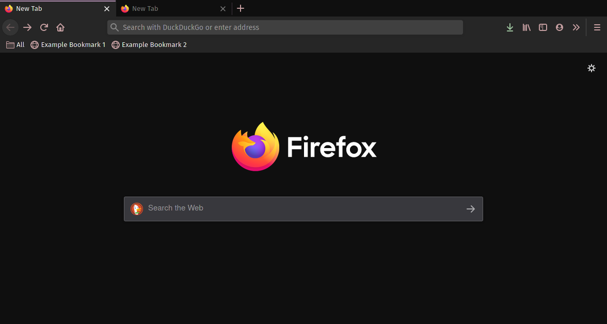

# Mountain - Firefox Theme

Mountain theme for Firefox. Made with [Firefox Color](https://color.firefox.com/).

### Installation

There are 2 ways of installing this.

1. Open the signed `.xpi` extension included in this directory.
2. Install from the firefox addons by going [here](https://addons.mozilla.org/en-US/firefox/addon/mountain_theme).  
  
You can also edit the colors yourself [here](https://color.firefox.com/?theme=XQAAAAJ-BAAAAAAAAABBqYhm849SCicxcUfbB38oKRicm6da8pHS_jJb-G_pjPXQAkFXTZounwn6yJfY7Md5a2gRuX77QZF3yq1OXWJ-4QQluY5UZGsPvcUJJaTpiM4wz3eYEoEfASHt0BcRwgWC0F0QluKkXXD5_gELtUi72e_F8IxjRTFIxf9G7AbaSNj5_yQ6xH-vwNMfXCxzmmiYzpVdPscn5Rp4OT7QF_mGHhj-beLZt8J7JYM5tMB_pJNMPn9AkkK8ynxo_KdQ9CmkWbEDUuBDhnmrxqFzVY6fL7rfRkJD467Rw391k1ibPXdtH8ORNq3O_xlZeZ9G40_kxc-a-YJPjVOTRvW3CF57WBIYH0pSTkmpCdkuB0iLZfWJf77ko66HMKhEkhceTLZqWclp_i4_BzVwM03q7TNVJj-hzxv0B1tU7tsJEJYMlkvTfVWfBN8FwL-mFQjiYMqduyxPGRN0ZCvJdEyGam734HWjtKov9vt3yLEiH6T63__j1L02fmYAogQpJz15e5sJ22H9TIyvHzRSBQOn06c8_WAi-__xjKKaCSOWTp_3GvM-hsOG9zqW-vtrQcVqC2lkZO1qNf4F1Mw).
